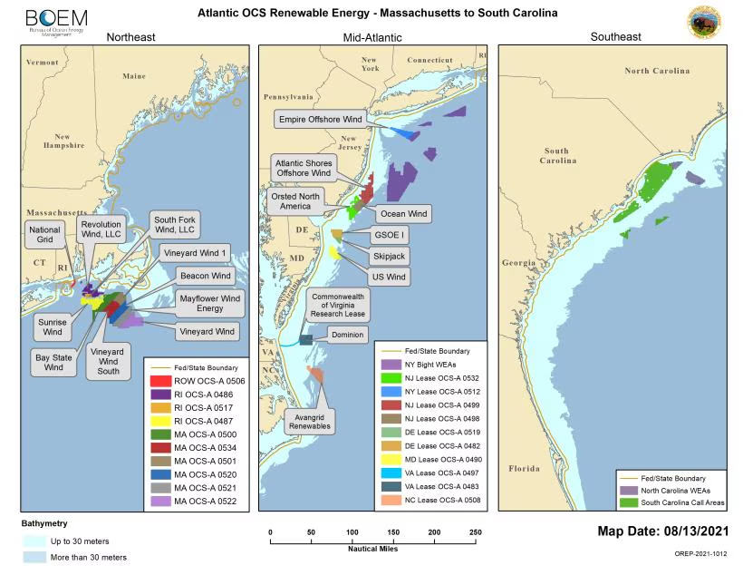

# ERA5 Analysis for Offshore Wind (with _kwindy_)

[][pre-commit]
[][black]

[pre-commit]: https://github.com/pre-commit/pre-commit
[black]: https://github.com/psf/black

## Overview

This repository contains the _kwindy_ package, which is short for "Katie's Windy Package". _Kwindy_ contains a small set of functions built for analyzing the ERA5 Reanalysis dataset that is available on Google Cloud Storage (https://github.com/google-research/arco-era5). This package was developed for quantifying and analyzing the wind resource in offshore environments.

To date, most of the analysis here focuses on the U.S. East Coast where there is the highest density of offshore wind development in the U.S. Below are maps from the U.S. Bureau of Ocean Energy and Management (BOEM) showing where there are present and future lease areas for offshore wind development along the U.S. East Coast. 

## Installation

You can install _kwindy_ via [pip]. First clone the repo:

```console
$ git clone https://github.com/kbren/era5-analysis.git
```

Then from the `era5-analysis/` directory run:

```console
$ pip install .
```

## License

Distributed under the terms of the [MIT license][license],
_kwindy_ is free and open source software.

## Issues

If you encounter any problems,
please [file an issue] along with a detailed description.

## Credits

This project was generated from [@cjolowicz]'s [Hypermodern Python Cookiecutter] template.

[@cjolowicz]: https://github.com/cjolowicz
[pypi]: https://pypi.org/
[hypermodern python cookiecutter]: https://github.com/cjolowicz/cookiecutter-hypermodern-python
[file an issue]: https://github.com/kbren/era5-analysis/issues
[pip]: https://pip.pypa.io/

<!-- github-only -->

[license]: https://github.com/kbren/era5-analysis/blob/main/LICENSE
[contributor guide]: https://github.com/kbren/era5-analysis/blob/main/CONTRIBUTING.md
[command-line reference]: https://era5-analysis.readthedocs.io/en/latest/usage.html
